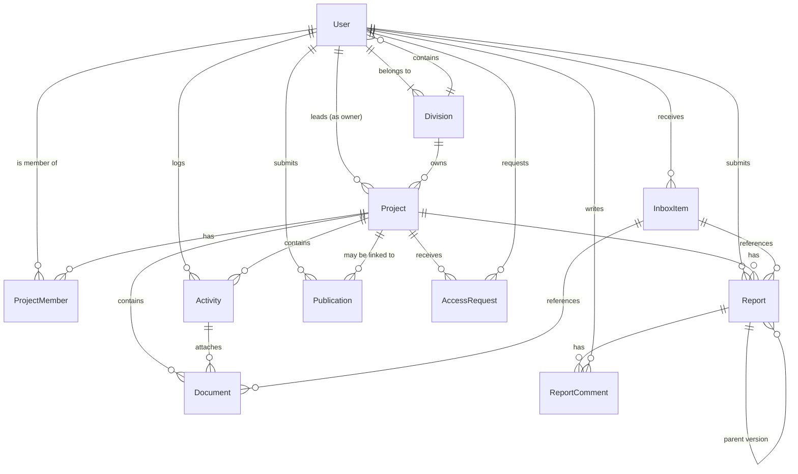

# Data Model

## Entity Relationship Diagram

## Entities

### User

| Field | Type | Required | Notes |
|-------|------|----------|-------|
| id | bigint, auto | ✅ | Primary key |
| email | varchar(255) | ✅ | Unique, used for login |
| password | varchar(255) | ✅ | Hashed |
| fullName | varchar(255) | ✅ | |
| role | enum | ✅ | `RESEARCHER`, `STUDENT`, `SECRETARY`, `DIVISION_HEAD`, `MANAGEMENT`, `ADMIN` |
| divisionId | bigint | ✅ | FK to `divisions` |
| isActive | boolean | ✅ | Admin can deactivate; inactive users cannot log in |
| avatarInitials | varchar(4) | ✅ | Auto-generated from fullName |
| createdAt | timestamp | ✅ | |
| updatedAt | timestamp | ✅ | |

### Division

| Field | Type | Required | Notes |
|-------|------|----------|-------|
| id | bigint, auto | ✅ | Primary key |
| name | varchar(255) | ✅ | |
| headId | bigint, nullable | ❌ | FK to `users` (Division Head) |
| createdAt | timestamp | ✅ | |
| updatedAt | timestamp | ✅ | |

### Project

| Field | Type | Required | Notes |
|-------|------|----------|-------|
| id | bigint, auto | ✅ | Primary key |
| title | varchar(255) | ✅ | |
| description | text | ❌ | |
| divisionId | bigint | ✅ | FK to `divisions` |
| leadResearcherId | bigint | ✅ | FK to `users` (owner) |
| fundingType | enum | ✅ | `DONOR`, `GOVERNMENT`, `INTERNAL` |
| fundingSource | varchar(255) | ❌ | Free-text description of specific funding |
| researchArea | varchar(255) | ❌ | |
| location | varchar(255) | ❌ | Geographic location of field work |
| startDate | date | ✅ | |
| endDate | date | ❌ | Nullable until project is completed/archived |
| status | enum | ✅ | `PROPOSED`, `ACTIVE`, `COMPLETED`, `ARCHIVED` |
| progress | tinyint | ✅ | 0–100, computed from milestones or manually set |
| createdAt | timestamp | ✅ | |
| updatedAt | timestamp | ✅ | |

### ProjectMember

| Field | Type | Required | Notes |
|-------|------|----------|-------|
| id | bigint, auto | ✅ | Primary key |
| projectId | bigint | ✅ | FK to `projects` |
| userId | bigint | ✅ | FK to `users` |
| role | enum | ✅ | `LEAD` (owner), `COLLABORATOR` (has access) |
| addedAt | timestamp | ✅ | |

### Activity

| Field | Type | Required | Notes |
|-------|------|----------|-------|
| id | bigint, auto | ✅ | Primary key |
| projectId | bigint | ✅ | FK to `projects` |
| userId | bigint | ✅ | FK to `users` (who logged it) |
| date | date | ✅ | Defaults to today |
| type | varchar(100) | ✅ | From `activity_types` table |
| description | text | ✅ | |
| notes | text | ❌ | |
| createdAt | timestamp | ✅ | |
| updatedAt | timestamp | ✅ | |

### ActivityType

| Field | Type | Required | Notes |
|-------|------|----------|-------|
| id | bigint, auto | ✅ | Primary key |
| name | varchar(100) | ✅ | Display name |
| slug | varchar(100) | ✅ | Machine-readable identifier |

### Document

| Field | Type | Required | Notes |
|-------|------|----------|-------|
| id | bigint, auto | ✅ | Primary key |
| projectId | bigint | ✅ | FK to `projects` |
| activityId | bigint, nullable | ❌ | FK to `activities` if uploaded during activity logging |
| uploadedBy | bigint | ✅ | FK to `users` |
| filename | varchar(255) | ✅ | Original filename |
| filePath | varchar(500) | ✅ | Storage path |
| mimeType | varchar(100) | ✅ | |
| size | int | ✅ | File size in bytes |
| type | enum | ✅ | `DATA_SHEET`, `PHOTO`, `MAP`, `RECEIPT`, `REPORT`, `MANUSCRIPT`, `OTHER` |
| published | boolean | ✅ | Default `false`. `true` = visible in library |
| createdAt | timestamp | ✅ | |
| updatedAt | timestamp | ✅ | |

### Report

| Field | Type | Required | Notes |
|-------|------|----------|-------|
| id | bigint, auto | ✅ | Primary key |
| projectId | bigint | ✅ | FK to `projects` |
| submittedBy | bigint | ✅ | FK to `users` |
| type | enum | ✅ | `QUARTERLY`, `MID_YEAR`, `ANNUAL` |
| periodStart | date | ✅ | |
| periodEnd | date | ✅ | |
| narrativeSummary | text | ✅ | |
| filePath | varchar(500) | ❌ | Path to uploaded report PDF |
| status | enum | ✅ | `DRAFT`, `PENDING`, `RETURNED`, `APPROVED`, `ESCALATED` |
| parentReportId | bigint, nullable | ❌ | FK to self — links resubmissions to original |
| version | int | ✅ | Starts at 1, incremented on resubmission |
| comment | text | ❌ | Secretary's comment (populated on return/escalation) |
| reviewedBy | bigint, nullable | ❌ | FK to `users` (the Secretary who acted) |
| submittedAt | timestamp | ❌ | Time of first submission (or latest resubmission) |
| createdAt | timestamp | ✅ | |
| updatedAt | timestamp | ✅ | |

### ReportComment

| Field | Type | Required | Notes |
|-------|------|----------|-------|
| id | bigint, auto | ✅ | Primary key |
| reportId | bigint | ✅ | FK to `reports` |
| userId | bigint | ✅ | FK to `users` |
| comment | text | ✅ | |
| createdAt | timestamp | ✅ | |

### Publication

| Field | Type | Required | Notes |
|-------|------|----------|-------|
| id | bigint, auto | ✅ | Primary key |
| title | varchar(500) | ✅ | Full paper/thesis title |
| authors | text | ✅ | Comma-separated or JSON array |
| type | enum | ✅ | `PAPER`, `THESIS`, `REPORT`, `STUDENT` |
| status | enum | ✅ | `DRAFT`, `SUBMITTED`, `IN_REVISION`, `PUBLISHED` |
| journalName | varchar(255) | ❌ | Journal name or target journal |
| linkedProjectId | bigint, nullable | ❌ | FK to `projects` |
| doi | varchar(255) | ❌ | Required only if status is `PUBLISHED` |
| manuscriptFilePath | varchar(500) | ❌ | Path to uploaded manuscript file |
| submittedById | bigint | ✅ | FK to `users` |
| studentName | varchar(255) | ❌ | Only if type is `STUDENT` |
| supervisor | varchar(255) | ❌ | Only if type is `STUDENT` |
| degreeProgramme | varchar(255) | ❌ | Only if type is `STUDENT` |
| submissionDate | date | ❌ | Date submitted to journal |
| revisionDueDate | date | ❌ | For `IN_REVISION` status |
| createdAt | timestamp | ✅ | |
| updatedAt | timestamp | ✅ | |

### InboxItem

| Field | Type | Required | Notes |
|-------|------|----------|-------|
| id | bigint, auto | ✅ | Primary key |
| userId | bigint | ✅ | FK to `users` (recipient) |
| senderId | bigint, nullable | ❌ | FK to `users` (null for system-generated) |
| type | enum | ✅ | `DOCUMENT`, `REPORT_UPDATE`, `SYSTEM` |
| subject | varchar(255) | ✅ | |
| message | text | ❌ | |
| documentId | bigint, nullable | ❌ | FK to `documents` (for DOCUMENT type) |
| reportId | bigint, nullable | ❌ | FK to `reports` (for REPORT_UPDATE type) |
| read | boolean | ✅ | Default `false` |
| createdAt | timestamp | ✅ | |

### AccessRequest

| Field | Type | Required | Notes |
|-------|------|----------|-------|
| id | bigint, auto | ✅ | Primary key |
| projectId | bigint | ✅ | FK to `projects` |
| requesterId | bigint | ✅ | FK to `users` |
| status | enum | ✅ | `PENDING`, `GRANTED`, `DENIED` |
| createdAt | timestamp | ✅ | |
| updatedAt | timestamp | ✅ | |

### Notification / Alert (via `notifications` table)

Laravel's native `notifications` table stores all user-facing alerts. The inbox and notification bell are backed by this table using the `database` notification channel.

| Field | Type | Notes |
|-------|------|-------|
| id | char(36) | UUID primary key |
| type | varchar(255) | Notification class name |
| notifiable_id | bigint | FK to `users` |
| notifiable_type | varchar(255) | `App\Models\User` |
| data | json | Arbitrary payload (subject, message, link, type) |
| read_at | timestamp, nullable | Null if unread |
| created_at | timestamp | |

## Enums Summary

| Enum | Values |
|------|--------|
| User.role | `RESEARCHER`, `STUDENT`, `SECRETARY`, `DIVISION_HEAD`, `MANAGEMENT`, `ADMIN` |
| Project.status | `PROPOSED`, `ACTIVE`, `COMPLETED`, `ARCHIVED` |
| Project.fundingType | `DONOR`, `GOVERNMENT`, `INTERNAL` |
| ProjectMember.role | `LEAD`, `COLLABORATOR` |
| Document.type | `DATA_SHEET`, `PHOTO`, `MAP`, `RECEIPT`, `REPORT`, `MANUSCRIPT`, `OTHER` |
| Report.type | `QUARTERLY`, `MID_YEAR`, `ANNUAL` |
| Report.status | `DRAFT`, `PENDING`, `RETURNED`, `APPROVED`, `ESCALATED` |
| Publication.type | `PAPER`, `THESIS`, `REPORT`, `STUDENT` |
| Publication.status | `DRAFT`, `SUBMITTED`, `IN_REVISION`, `PUBLISHED` |
| InboxItem.type | `DOCUMENT`, `REPORT_UPDATE`, `SYSTEM` |
| AccessRequest.status | `PENDING`, `GRANTED`, `DENIED` |

## Key Relationships

- **User → Division**: Many-to-one. A user belongs to exactly one division.
- **User → Project**: Many-to-many through `project_members`. A lead researcher owns the project; collaborators have access.
- **Project → Activity**: One-to-many. A project has many activities.
- **Activity → Document**: One-to-many. An activity can have many attached documents.
- **Project → Report**: One-to-many. A project has many reports (across reporting periods and versions).
- **Report → Report (parent)**: Self-referential. `parentReportId` links resubmissions to the original report.
- **Project → Publication**: One-to-many (optional). A publication can be linked to a project.
- **User → InboxItem**: One-to-many. Each user has many inbox items.
- **User → AccessRequest**: One-to-many. A user can request access to multiple projects.
